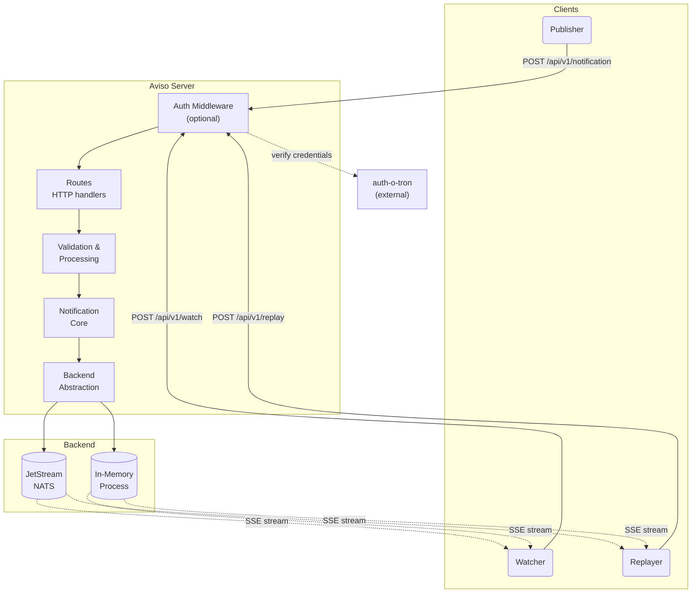
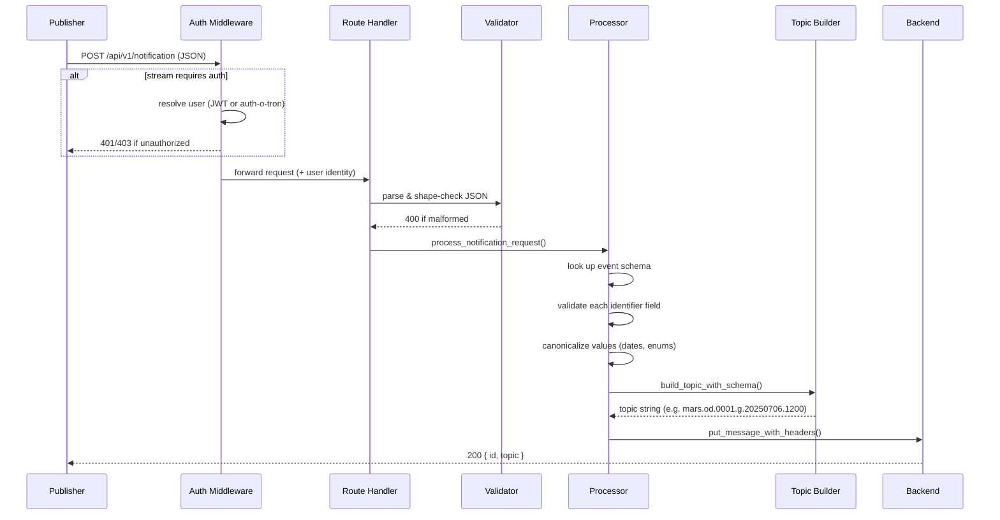
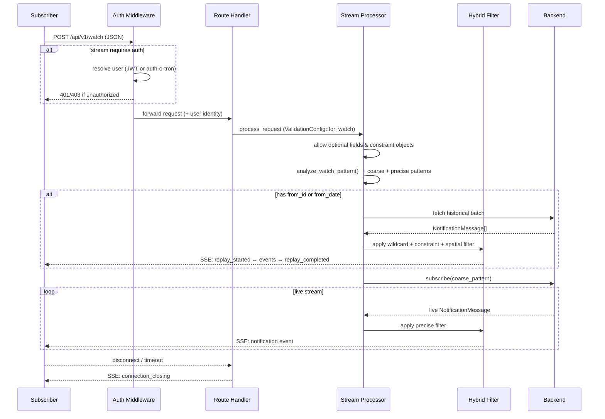
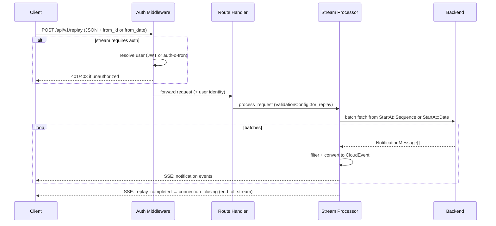
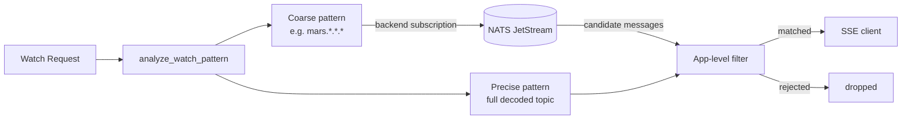

# Architecture

Aviso Server is built around three operations — **Notify**, **Watch**, and **Replay** —
each sharing a common validation and schema layer but diverging at the backend interaction.

---

## System Overview

---

## Notify Request Flow

When a publisher sends `POST /api/v1/notification`:

Key steps:

1. **Parse** — raw JSON bytes are deserialized; unknown fields are rejected (`UNKNOWN_FIELD`)
2. **Validate** — each identifier field is checked against its `ValidationRules` (type, range, enum values)
3. **Canonicalize** — values are normalized (e.g. dates to `YYYYMMDD`, enums to lowercase)
4. **Build topic** — fields are ordered per `key_order`, reserved chars are percent-encoded
5. **Store** — the message is written to the backend with the encoded topic as the subject

---

## Watch Request Flow

`POST /api/v1/watch` opens a persistent SSE stream. It optionally starts with a historical
replay phase before transitioning to live delivery.

---

## Replay Request Flow

`POST /api/v1/replay` is like watch but historical-only — the stream closes when history ends.

---

## SSE Streaming Pipeline

The streaming layer (`src/sse/`) is built around typed values rather than raw strings,
which keeps the lifecycle explicit and the endpoint logic thin.

**Cursor types** — how a start point is represented internally:

- `StartAt::LiveOnly` — no history, subscribe immediately
- `StartAt::Sequence(u64)` — start from a specific backend sequence number
- `StartAt::Date(DateTime<Utc>)` — start from a UTC timestamp

**Frame types** — what the stream produces before rendering to SSE wire format:

- Control frames — `connection_established`, `replay_started`, `replay_completed`
- Notification frames — a decoded CloudEvent ready for delivery
- Heartbeat frames — periodic keep-alive
- Error frames — non-fatal stream errors
- Close frame — carries one of: `end_of_stream`, `max_duration_reached`, `server_shutdown`

Lifecycle (shutdown token, max duration, natural end) is applied once in a shared wrapper,
so individual endpoint handlers don't need to reimplement it.

---

## Component Map

| Component | Path | Role |
|---|---|---|
| Routes | `src/routes/` | Thin HTTP handlers — parse request, delegate, return response |
| Auth | `src/auth/` | Middleware, JWT validation, role matching, auth-o-tron client |
| Handlers | `src/handlers/` | Shared parsing, validation, and processing logic |
| Notification core | `src/notification/` | Schema registry, topic builder/codec/parser, wildcard matcher, spatial |
| Backend abstraction | `src/notification_backend/` | `NotificationBackend` trait + JetStream and InMemory implementations |
| SSE layer | `src/sse/` | Stream composition, typed frames, heartbeats, lifecycle |
| CloudEvents | `src/cloudevents/` | Converts stored messages into CloudEvent envelope |
| Configuration | `src/configuration/` | Config loading, schema validation, global snapshot |
| Error model | `src/error.rs` | Stable HTTP error codes and structured responses |

---

## Hybrid Filtering

Watch subscriptions use a two-tier strategy to balance backend load with filter precision:

- The **coarse pattern** is sent to the backend as the subscription subject filter.
  It uses NATS wildcards and covers a superset of the desired messages.
- The **precise pattern** is applied in-process on decoded topics + constraint objects + spatial checks.
  Only messages that pass both layers reach the client.

This avoids creating one backend subscription per unique topic while still delivering exact results.

---

## JetStream Backend Internals

| Module | Path | Responsibility |
|---|---|---|
| Config | `notification_backend/jetstream/config.rs` | Decode and validate JetStream settings |
| Connection | `notification_backend/jetstream/connection.rs` | NATS connect with retry |
| Streams | `notification_backend/jetstream/streams.rs` | Create and reconcile streams |
| Publisher | `notification_backend/jetstream/publisher.rs` | Publish with retry on transient failures |
| Subscriber | `notification_backend/jetstream/subscriber.rs` | Consumer-based live subscriptions |
| Replay | `notification_backend/jetstream/replay.rs` | Pull consumer batch retrieval |
| Admin | `notification_backend/jetstream/admin.rs` | Wipe and delete operations |
