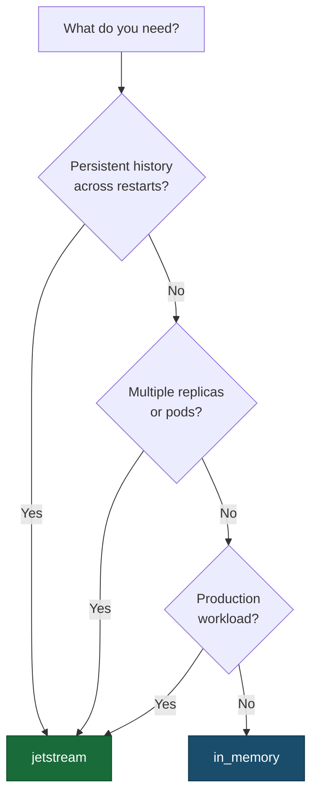

# Backends Overview

Aviso abstracts all storage and messaging behind a `NotificationBackend` trait.
Two implementations ship out of the box.

---

## Which Backend Should I Use?

| Requirement | Recommended backend |
|---|---|
| Persistent history across restarts | `jetstream` |
| Replay endpoint support | `jetstream` (or `in_memory` for local/node-local use) |
| Live watch streaming support | `jetstream` (or `in_memory` for local/node-local use) |
| Multi-replica deployment | `jetstream` |
| Quick local experimentation with minimal setup | `in_memory` |

---

## Capability Comparison

| Capability | JetStream | In-Memory |
|---|---|---|
| Durable storage | Yes | No — data lost on restart |
| Replay support | Yes | Yes — node-local only |
| Live watch support | Yes | Yes — node-local fan-out |
| Multi-replica / HA | Yes (clustered NATS) | No |
| Per-schema storage policy | Yes | No — rejected at startup |
| Cross-instance consistency | Yes | No |

---

## Backend Details

- [In-Memory Backend](./backend-in-memory.md) — behavior, config, production caveats
- [JetStream Backend](./backend-jetstream.md) — setup, stream management, operational notes
- [Backend Development](./backend-development.md) — how to implement a new backend
