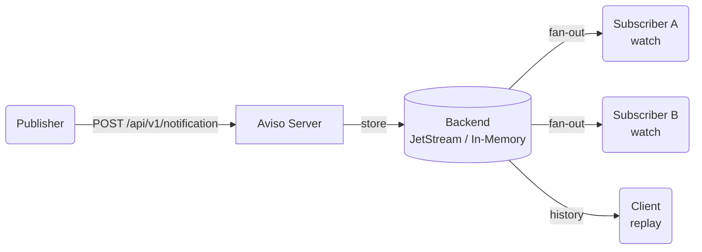

  
  

 

# Introduction

**Aviso Server** is a real-time notification and historical replay system built for data dissemination pipelines.
It lets publishers announce data availability events and lets subscribers receive those events
— either live as they happen, or replayed from a chosen point in history.

It is designed for environments where timely, reliable notification of data availability is critical:
scientific computing, operational weather forecasting pipelines, large-scale data distribution, and similar domains.

---

## How It Works

At its core, Aviso Server exposes three operations:

| Operation | Endpoint | Description |
|---|---|---|
| **Notify** | `POST /api/v1/notification` | Publish a notification event to the backend |
| **Watch** | `POST /api/v1/watch` | Stream live (and optionally historical) events over SSE |
| **Replay** | `POST /api/v1/replay` | Stream historical events only, then close |

---

## Key Features

### Schema-driven validation
Each event type can have a schema that defines which identifier fields are required,
their types (date, time, integer, float, enum, polygon), allowed ranges, and topic ordering.
Invalid notifications are rejected at the API boundary with a clear error.

### Structured topic routing
Aviso builds a deterministic topic string from the notification's identifier fields.
This topic is used to route, store, and filter messages in the backend.
Subscribers can use wildcard patterns and constraint objects to filter the stream.

### Hybrid filtering
Watch and replay requests are matched using a two-tier strategy:
the backend handles coarse routing (broad subject filters), and Aviso applies
precise application-level filtering (constraints, spatial checks) on top.
This keeps backend subscription counts low while delivering exact results.

### Spatial awareness
Polygon and point identifiers are first-class — notifications can carry geographic polygons,
and subscribers can filter by polygon intersection or point containment.

### Pluggable backends
Aviso abstracts storage behind a `NotificationBackend` trait.
Today two backends ship: **JetStream** (NATS-backed, durable, production-ready)
and **In-Memory** (single-process, for development and testing).

### Server-Sent Events (SSE)
Watch and replay streams use SSE — a simple, firewall-friendly HTTP streaming protocol
supported natively by browsers and all major HTTP clients.
The stream includes typed control frames (connection established, replay started/completed,
heartbeats, and graceful close reasons).

### CloudEvents format
All delivered notifications follow the [CloudEvents](https://cloudevents.io/) specification,
making them easy to integrate with other event-driven systems.

---

## Use Cases

- **Data availability monitoring** — trigger downstream workflows the moment a dataset lands
- **Operational pipelines** — coordinate processing steps across distributed services
- **Audit and compliance** — replay historical events to reconstruct what was published and when
- **System integration** — connect disparate systems through a standardized event interface

---

## Where to Go Next

If you are new to Aviso, read these pages in order:

1. [Key Concepts](./concepts.md) — understand the terminology before anything else
2. [Installation](./installation.md) — get the server running
3. [Getting Started](./getting-started.md) — send your first notification and watch it arrive
4. [Practical Examples](./practical-examples/overview.md) — copy-paste workflows for common scenarios

If you are configuring for production:

- [Deployment Modes](./deployment-modes.md)
- [Configuration](./configuration.md) and [Configuration Reference](./configuration-reference.md)
- [JetStream Backend](./backend-jetstream.md)
