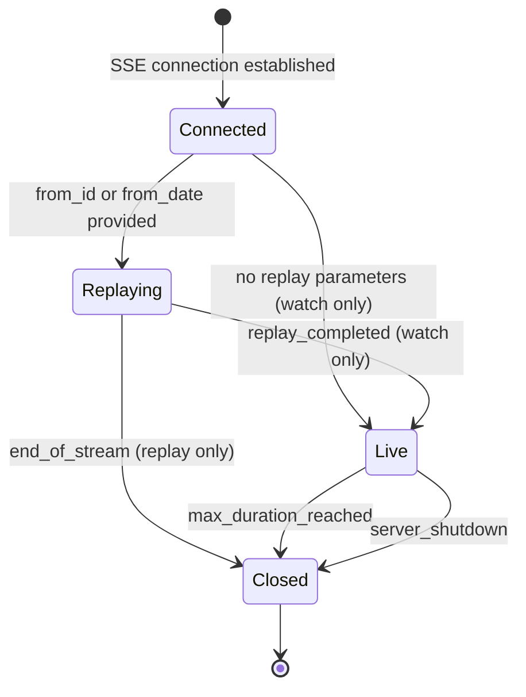
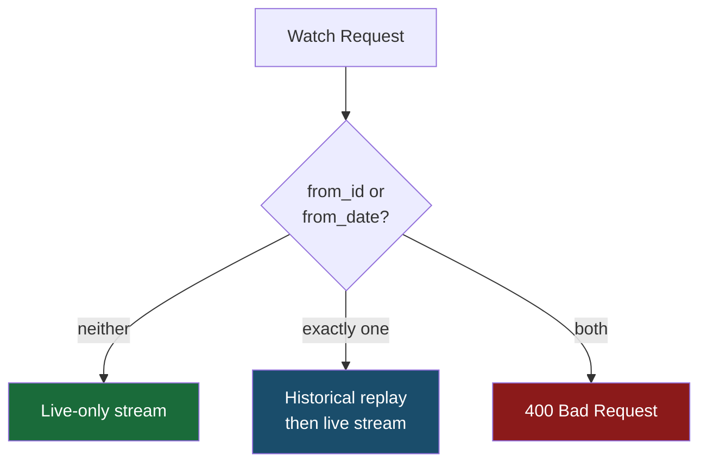
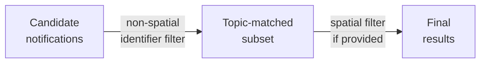

# Streaming Semantics

This page defines the exact behavior of the watch and replay endpoints,
including start points, spatial filtering, identifier constraints, and SSE lifecycle events.

---

## Request ID Correlation

Every HTTP response carries an `X-Request-ID` header with a per-request UUID.
The same UUID is also embedded in the JSON `data:` payload of certain SSE
events so that a client which only sees the body (not headers) can still
quote it back when reporting a problem.

A note on terminology before the tables: SSE has two related but distinct
labels for an event. The `event:` line is the SSE-level type that an
`EventSource.addEventListener(name, handler)` call dispatches on. The
`data.type` field (when present) is an aviso-level discriminator inside the
JSON body, used for the cases where we reuse a single `event:` name for
several control events. A wire example:

```text
event: live-notification
data: {"type":"connection_established","topic":"...","timestamp":"...","connection_will_close_in_seconds":3600,"request_id":"<uuid>"}
```

The `event:` line above is `live-notification` (so an EventSource client
listens for `live-notification`); the `data.type` value is
`connection_established` (so the client distinguishes it from a normal
notification, which has no `type` field).

In-stream events that include `request_id`:

| SSE `event:` | `data.type` (when present) | Frequency | Purpose |
|---|---|---|---|
| `live-notification` | `connection_established` | Once at the start of a live-only watch | First-event correlation |
| `replay-control` | `replay_started` | Once at the start of any stream that begins with replay | First-event correlation |
| `error` | (none; uses `error` field as discriminator) | Rare, on mid-stream backend or CloudEvent-creation failure | Failure-event correlation |
| `connection-closing` | (none; uses `reason` field as discriminator) | Once on graceful close | Final-event correlation |

In-stream events that intentionally do **not** include `request_id`:

| SSE `event:` | `data.type` (when present) | Frequency | Why |
|---|---|---|---|
| `live-notification` | (none; CloudEvent body) | Per message | Repeating the same UUID on every notification would inflate the wire for no extra value (correlation is already covered by the first event and the response header) |
| `replay` | (none; CloudEvent body) | Per message | Same |
| `heartbeat` | (none) | Every few seconds | Same |
| `replay-control` | `replay_completed`, `notification_replay_limit_reached` | Replay phase boundaries | The first `replay-control` event (`replay_started`) already carries the UUID; repeating it is noise |

The first event of any stream is guaranteed to carry the `request_id` (a
`live-notification` event with `data.type = "connection_established"` for
live-only watches, or a `replay-control` event with `data.type =
"replay_started"` for any stream that begins with replay).

## Reconnecting after disconnect

If a stream drops (network blip, client restart, connection_closing with
reason `max_duration_reached`, etc.), the recommended reconnect protocol is:

1. Remember the `sequence` field of the last `live-notification` or `replay`
   event you successfully processed. The sequence is in the CloudEvent
   payload of every notification.
2. Issue a fresh `POST /api/v1/watch` (or `/api/v1/replay`) with `from_id`
   set to that sequence value plus 1.

That gives you exact at-least-once continuation without losing or
duplicating notifications.

Aviso does **not** use the SSE `id:` field or the `Last-Event-ID` request
header. Both are part of the browser EventSource auto-reconnect mechanism;
aviso supports a richer `from_id` + `from_date` reconnect contract via the
POST request body, and we deliberately keep one explicit reconnect mechanism
rather than expose two overlapping ones.

If you need time-based catch-up rather than sequence-based, use `from_date`
instead of `from_id` (see [Start Point for Historical
Events](#start-point-for-historical-events) below for accepted formats).

## SSE Stream Lifecycle

Every streaming response (watch or replay) goes through a typed lifecycle:



Close reasons emitted in the final `connection_closing` SSE event:

| Reason | Trigger |
|---|---|
| `end_of_stream` | Replay finished (`/replay` endpoint, or watch replay phase if live subscribe fails) |
| `max_duration_reached` | `connection_max_duration_sec` elapsed on a watch stream |
| `server_shutdown` | Server is shutting down gracefully |

---

## `POST /api/v1/watch`

- If both `from_id` and `from_date` are omitted:
  - stream is live-only (new notifications from now onward).
- If exactly one replay parameter is present:
  - historical replay starts first, then transitions to live stream.
- If both are present:
  - request is rejected with `400`.



---

## `POST /api/v1/replay`

- Requires exactly one replay start parameter:
  - `from_id` (sequence-based), or
  - `from_date` (time-based).
- If both are missing or both are present:
  - request is rejected with `400`.
- Stream closes with `end_of_stream` when history is exhausted.

---

## Start Point for Historical Events

`from_id` starts delivery from that sequence number (inclusive).
`from_date` accepts any of these formats:

| Format | Example |
|---|---|
| RFC3339 with timezone | `2025-01-15T10:00:00Z` |
| RFC3339 with offset | `2025-01-15T10:00:00+02:00` |
| Space-separated with timezone | `2025-01-15 10:00:00+00:00` |
| Naive datetime (interpreted as UTC) | `2025-01-15T10:00:00` |
| Unix seconds (≤ 11 digits) | `1740509903` |
| Unix milliseconds (≥ 12 digits) | `1740509903710` |

All inputs are normalized to UTC internally.

---

## Spatial Filter Model

Spatial filtering applies on top of the identifier field filters.
Think of it in two layers:

- **Non-spatial identifier fields** (`time`, `date`, `class`, etc.) narrow candidates by topic routing.
- **Spatial fields** (`polygon` or `point`) further narrow that candidate set geographically.



### Rules

| `identifier.polygon` | `identifier.point` | Result |
|---|---|---|
| provided | omitted | polygon-intersects-polygon filter |
| omitted | provided | point-inside-notification-polygon filter |
| omitted | omitted | no spatial filter |
| provided | provided | `400 Bad Request` |

- `identifier.polygon`: keep notifications whose stored polygon intersects the request polygon.
- `identifier.point`: keep notifications whose stored polygon contains the request point.
- Both together: invalid — request is rejected.

---

## Identifier Constraints (`watch` / `replay`)

For schema-backed event types, identifier fields in watch/replay requests accept
**constraint objects** instead of (or in addition to) scalar values.
A scalar value is treated as an implicit `eq` constraint.

Constraint objects are **rejected on `/notification`** — notify only accepts scalar values.

### Supported operators by field type

| Handler | Operators |
|---|---|
| `IntHandler` | `eq`, `in`, `gt`, `gte`, `lt`, `lte`, `between` |
| `FloatHandler` | `eq`, `in`, `gt`, `gte`, `lt`, `lte`, `between` |
| `EnumHandler` | `eq`, `in` |

### Notes

- `between` expects exactly two values `[min, max]` and is **inclusive** on both ends.
- Float constraints reject `NaN` and `inf` — only finite values are valid.
- Float `eq` and `in` use **exact** numeric equality; no tolerance window is applied.
- A constraint object must contain **exactly one operator** — combining operators in a single object is rejected.

### Examples

```json
{ "severity": { "gte": 5 } }
{ "severity": { "between": [3, 7] } }
{ "region":   { "in": ["north", "south"] } }
{ "anomaly":  { "lt": 50.0 } }
```

---

## Backend Behavior

| Backend | Historical replay | Live watch |
|---|---|---|
| `in_memory` | Node-local only; clears on restart | Node-local fan-out |
| `jetstream` | Durable; survives restarts | Cluster-wide fan-out |

---

## SSE Timestamp Format

All control, heartbeat, and close event timestamps use canonical UTC second precision:

```
YYYY-MM-DDTHH:MM:SSZ
```

Example: `2026-02-25T18:58:23Z`

---

## Replay Payload Shape

- Replay and watch CloudEvent output always includes `data.payload`.
- If a notify request omitted payload (optional schema), replay returns `data.payload = null`.
- Payload values are not reshaped — scalar strings remain strings, objects remain objects.

See [Payload Contract](./payload-contract.md) for the full input → storage → output mapping.

---

For end-to-end examples, see:

- [Basic Notify/Watch/Replay](./practical-examples/basic-notify-watch-replay.md)
- [Constraint Filtering](./practical-examples/constraint-filtering.md)
- [Spatial Filtering](./practical-examples/spatial-filtering.md)
- [Replay Starting Points](./practical-examples/replay-starting-points.md)
