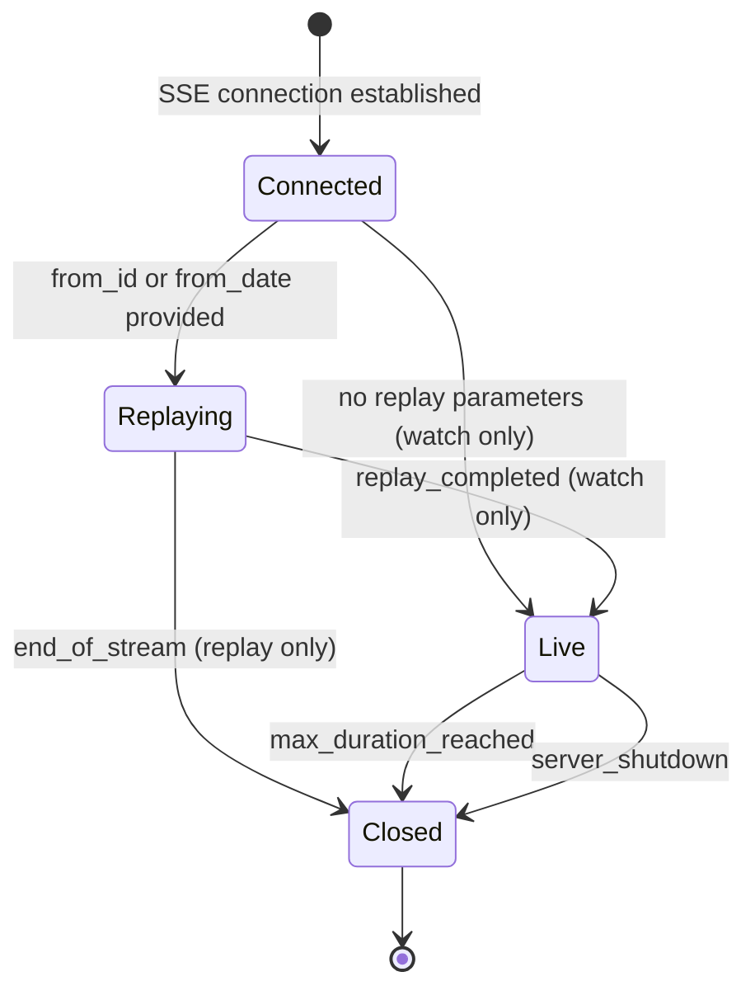
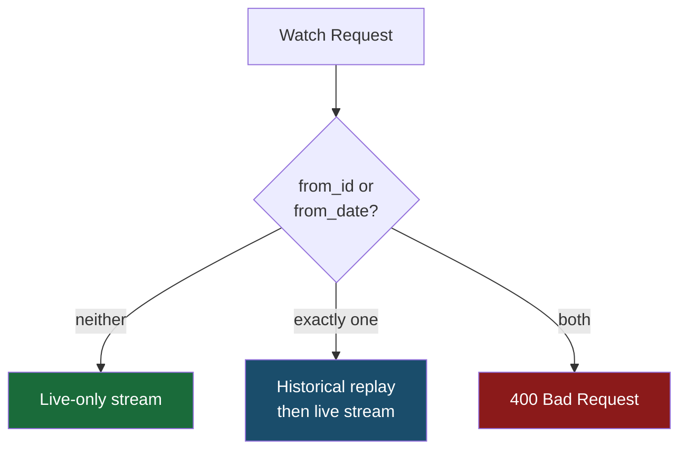
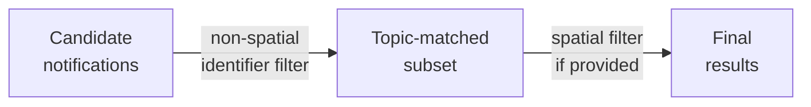

# Streaming Semantics

This page defines the exact behavior of the watch and replay endpoints,
including start points, spatial filtering, identifier constraints, and SSE
lifecycle events.

---

## Request ID Correlation

Every HTTP response carries an `X-Request-ID` header with a per-request UUID.
The same UUID is also embedded in the JSON `data:` payload of certain SSE events
so that a client which only sees the body (not headers) can still quote it back
when reporting a problem.

A note on terminology before the tables: SSE has two related but distinct labels
for an event. The `event:` line is the SSE-level type that an
`EventSource.addEventListener(name, handler)` call dispatches on. The
`data.type` field (when present) is an aviso-level discriminator inside the JSON
body, used for the cases where we reuse a single `event:` name for several
control events. A wire example:

```text
event: live-notification
data: {"type":"connection_established","topic":"...","timestamp":"...","connection_will_close_in_seconds":3600,"request_id":"<uuid>"}
```

The `event:` line above is `live-notification` (so an EventSource client listens
for `live-notification`); the `data.type` value is `connection_established` (so
the client distinguishes it from a normal notification, which has no `type`
field).

In-stream events that include `request_id`:

| SSE `event:`         | `data.type` (when present)                   | Frequency                                                  | Purpose                   |
| -------------------- | -------------------------------------------- | ---------------------------------------------------------- | ------------------------- |
| `live-notification`  | `connection_established`                     | Once at the start of a live-only watch                     | First-event correlation   |
| `replay-control`     | `replay_started`                             | Once at the start of any stream that begins with replay    | First-event correlation   |
| `error`              | (none; uses `error` field as discriminator)  | Rare, on mid-stream backend or CloudEvent-creation failure | Failure-event correlation |
| `connection-closing` | (none; uses `reason` field as discriminator) | Once on graceful close                                     | Final-event correlation   |

In-stream events that intentionally do **not** include `request_id`:

| SSE `event:`        | `data.type` (when present)                              | Frequency               | Why                                                                                                                                                                 |
| ------------------- | ------------------------------------------------------- | ----------------------- | ------------------------------------------------------------------------------------------------------------------------------------------------------------------- |
| `live-notification` | (none; CloudEvent body)                                 | Per message             | Repeating the same UUID on every notification would inflate the wire for no extra value (correlation is already covered by the first event and the response header) |
| `replay`            | (none; CloudEvent body)                                 | Per message             | Same                                                                                                                                                                |
| `heartbeat`         | (none)                                                  | Every few seconds       | Same                                                                                                                                                                |
| `replay-control`    | `replay_completed`, `notification_replay_limit_reached` | Replay phase boundaries | The first `replay-control` event (`replay_started`) already carries the UUID; repeating it is noise                                                                 |

The first event of any stream is guaranteed to carry the `request_id` (a
`live-notification` event with `data.type = "connection_established"` for
live-only watches, or a `replay-control` event with
`data.type = "replay_started"` for any stream that begins with replay).

## Historical Replay Limits

`watch_endpoint.max_historical_notifications` limits historical notifications
delivered by one request, not one backend batch. Identifier matching,
identifier constraints, spatial filtering and successful CloudEvent rendering
happen before quota accounting. Render failures emit errors without consuming
the quota. A schema's `max_historical_notifications` overrides the global cap;
omitting it inherits the global default of `10000`.
`replay_batch_size` controls fetching independently of this quota. Excluded
notifications do not consume it, even when entire batches are excluded.

After filling the quota, replay looks for one more renderable matching
notification. If history is exhausted first, replay completes normally.
Otherwise the server emits a `replay-control` event with these data fields:

```json
{"type":"notification_replay_limit_reached","topic":"example.*","max_allowed":2,"message":"Historical replay limited to 2 messages. Additional historical messages may be available but were not retrieved.","timestamp":"2026-01-01T00:00:00Z"}
```

The limit control is followed by `connection-closing` with reason
`end_of_stream`. There is no `replay_completed` event and a watch does not
transition to live delivery. Treat this as a history gap, not successful
catch-up. `max_allowed` is always present and reports the effective request
cap, including a schema override. A new request gets a fresh quota.

Caps must be positive integers. Zero and `unlimited` are not accepted.
If fetching a historical batch fails, including during lookahead, the server
emits `event: error` and closes without `replay_completed`, a limit control or
live delivery. This is failed catch-up, not exhausted history. Individual
CloudEvent rendering failures remain nonfatal and do not consume the quota.

Live-only watches are not limited.

## Replay/Live Boundary

A watch captures an inclusive history sequence bound `H` atomically with live
subscription creation. Replay reads only sequences `<= H`, then emits
`replay_completed` before delivering live sequences `> H`. Publications during
catch-up belong to live delivery, not to later historical batches. No
last-delivered watermark is used to discard queued live notifications.

A replay-only request captures `H` during setup without creating a live
subscription. Its sequence range stays fixed across every page, including quota
lookahead. Messages above `H` cannot consume the replay quota or prove
truncation. A deleted or filtered message at `H` does not prevent completion.

This snapshots a sequence range, not immutable storage. Deletion, overwrite and
retention can remove history before it is read. In-memory live queues can lag;
JetStream retention can remove queued live messages before delivery. The
boundary prevents replay/live overlap, but does not guarantee lossless delivery.

Sequence and date start cursors constrain history only. A start beyond `H` (or
a future date) can produce empty replay, after which a watch still delivers new
notifications from its subscription creation point. Setup failures return an
HTTP error, not a successful replay completion.

## Reconnecting after disconnect

If a stream drops (network blip, client restart, `connection-closing` with
reason `max_duration_reached`, etc.), the recommended reconnect protocol is:

1. Read the top-level CloudEvent `id` from each notification's SSE `data:` body.
   It has the form `<event_type>@<sequence>`, such as `extreme_event@123`. The
   numeric suffix is the sequence; normal notifications do not have a separate
   `sequence` field. Control events, including `connection_established`, are not
   notification checkpoints.
2. Save progress only after successfully processing the notification. If
   processing concurrently, do not advance the checkpoint past unfinished
   notifications.
3. Issue a fresh `POST /api/v1/watch` (or `/api/v1/replay`) with the same event
   type and filters. Set `from_id` to the saved sequence plus 1, encoded as a
   decimal JSON string, and omit `from_date`. The client computes this increment;
   the server treats `from_id` as inclusive.

For example, after processing and saving a checkpoint for `extreme_event@123`,
send a new `POST /api/v1/watch` request with this JSON body, keeping the same
identifier filters as the original request:

```json
{
  "event_type": "extreme_event",
  "identifier": {},
  "from_id": "124"
}
```

Here, `identifier: {}` represents a request without identifier filters. Replace
it with your original filters; schemas with required filters do not accept an
empty identifier object.

This avoids requesting the checkpoint notification again, but does not guarantee
duplicate-free processing. A crash after applying an effect but before saving
progress can cause that notification to be processed again. Use idempotent
handlers or deduplicate notifications within the same backend history.

Recovery depends on the requested history still being available. Retention or
deletion can remove notifications, and in-memory history is node-local and
disappears on restart. A saved cursor is not portable across unrelated or reset
backend histories. Reconnecting cannot recover history that is no longer stored
and does not guarantee lossless delivery. Each reconnect is still subject to the
[historical replay limits](#historical-replay-limits) above.

If you need time-based catch-up rather than sequence-based, use `from_date`
instead of `from_id` (see
[Start Point for Historical Events](#start-point-for-historical-events) below
for accepted formats).

## SSE Stream Lifecycle

Every streaming response (watch or replay) goes through a typed lifecycle:


```mermaid
stateDiagram-v2
    [*] --> Connected : SSE connection established
    Connected --> Replaying : from_id or from_date provided
    Connected --> Live : no replay parameters (watch only)
    Replaying --> Live : replay_completed (watch only)
    Replaying --> Closed : end_of_stream (replay only)
    Live --> Closed : max_duration_reached
    Live --> Closed : server_shutdown
    Closed --> [*]
```

Close reasons emitted in the final `connection-closing` SSE event:

| Reason                 | Trigger                                                                             |
| ---------------------- | ----------------------------------------------------------------------------------- |
| `end_of_stream`        | Replay finished, was truncated, or failed during batch retrieval                    |
| `max_duration_reached` | `connection_max_duration_sec` elapsed on a watch stream                             |
| `server_shutdown`      | Server is shutting down gracefully                                                  |

---

## `POST /api/v1/watch`

- If both `from_id` and `from_date` are omitted:
  - stream is live-only (new notifications from now onward).
- If exactly one replay parameter is present:
  - historical replay starts first, then transitions to live stream.
- If both are present:
  - request is rejected with `400`.


```mermaid
flowchart TD
    A["Watch Request"] --> B{"from_id or<br/>from_date?"}
    B -->|neither| C["Live-only stream"]
    B -->|exactly one| D["Historical replay<br/>then live stream"]
    B -->|both| E["400 Bad Request"]

    style E fill:#8b1a1a,color:#fff
    style C fill:#1a6b3a,color:#fff
    style D fill:#1a4d6b,color:#fff
```

---

## `POST /api/v1/replay`

- Requires exactly one replay start parameter:
  - `from_id` (sequence-based), or
  - `from_date` (time-based).
- If both are missing or both are present:
  - request is rejected with `400`.
- Stream closes with `end_of_stream` when history is exhausted.

---

## Start Point for Historical Events

`from_id` is an unsigned 64-bit sequence number encoded as a JSON string.
Historical delivery starts at that number (inclusive), subject to the request
filters and available history. Send a decimal string, not a JSON number or the
full CloudEvent `id`. The value `"0"` starts from the beginning of available
matching history.

`from_date` accepts any of these formats:

| Format                              | Example                     |
| ----------------------------------- | --------------------------- |
| RFC3339 with timezone               | `2025-01-15T10:00:00Z`      |
| RFC3339 with offset                 | `2025-01-15T10:00:00+02:00` |
| Space-separated with timezone       | `2025-01-15 10:00:00+00:00` |
| Naive datetime (interpreted as UTC) | `2025-01-15T10:00:00`       |
| Unix seconds (≤ 11 digits)          | `1740509903`                |
| Unix milliseconds (≥ 12 digits)     | `1740509903710`             |

All inputs are normalized to UTC internally.

---

## Spatial Filter Model

Spatial filtering applies on top of the identifier field filters. Think of it in
two layers:

- **Non-spatial identifier fields** (`time`, `date`, `class`, etc.) narrow
  candidates by topic routing.
- **Spatial fields** (`polygon` or `point`) further narrow that candidate set
  geographically.


```mermaid
flowchart LR
    A["Candidate<br/>notifications"] -->|"non-spatial<br/>identifier filter"| B["Topic-matched<br/>subset"]
    B -->|"spatial filter<br/>if provided"| C["Final<br/>results"]
```

### Rules

| `identifier.polygon` | `identifier.point` | Result                                   |
| -------------------- | ------------------ | ---------------------------------------- |
| provided             | omitted            | polygon-intersects-polygon filter        |
| omitted              | provided           | point-inside-notification-polygon filter |
| omitted              | omitted            | no spatial filter                        |
| provided             | provided           | `400 Bad Request`                        |

- `identifier.polygon`: keep notifications whose stored polygon intersects the
  request polygon.
- `identifier.point`: keep notifications whose stored polygon contains the
  request point.
- Both together: invalid (the request is rejected).

Point-cloud schemas use a different provider and subscriber pair. Providers send
`identifier.point_cloud` on `/notification`. Subscribers send
`identifier.polygon` on `/watch` or `/replay`. A notification matches when any
cloud point is inside the request polygon or on an edge or vertex. Aviso checks
the stored bounding box first, then stops at the first matching point.

The request polygon satisfies a required `point_cloud` field for watch and
replay. Subscribers cannot send `point_cloud`. See
[Point-Cloud Filtering](./practical-examples/point-cloud-filtering.md) for the
schema and request contract.

---

## Identifier Constraints (`watch` / `replay`)

For schema-backed event types, identifier fields in watch/replay requests accept
**constraint objects** instead of (or in addition to) scalar values. A scalar
value is treated as an implicit `eq` constraint.

Constraint objects are **rejected on `/notification`**: notify only accepts
scalar values.

### Supported operators by field type

| Handler        | Operators                                       |
| -------------- | ----------------------------------------------- |
| `IntHandler`   | `eq`, `in`, `gt`, `gte`, `lt`, `lte`, `between` |
| `FloatHandler` | `eq`, `in`, `gt`, `gte`, `lt`, `lte`, `between` |
| `EnumHandler`  | `eq`, `in`                                      |

### Notes

- `between` expects exactly two values `[min, max]` and is **inclusive** on both
  ends.
- Float constraints reject `NaN` and `inf`; only finite values are valid.
- Float `eq` and `in` use **exact** numeric equality; no tolerance window is
  applied.
- A constraint object must contain **exactly one operator**; combining operators
  in a single object is rejected.

### Examples

```json
{ "severity": { "gte": 5 } }
{ "severity": { "between": [3, 7] } }
{ "region":   { "in": ["north", "south"] } }
{ "anomaly":  { "lt": 50.0 } }
```

---

## Backend Behavior

| Backend     | Historical replay                  | Live watch           |
| ----------- | ---------------------------------- | -------------------- |
| `in_memory` | Node-local only; clears on restart | Node-local fan-out   |
| `jetstream` | Durable; survives restarts         | Cluster-wide fan-out |

---

## SSE Timestamp Format

All control, heartbeat, and close event timestamps use canonical UTC second
precision:

```text
YYYY-MM-DDTHH:MM:SSZ
```

Example: `2026-02-25T18:58:23Z`

---

## Replay Payload Shape

- Replay and watch CloudEvent output always includes `data.payload`.
- If a notify request omitted payload (optional schema), replay returns
  `data.payload = null`.
- Payload values are not reshaped; scalar strings remain strings, objects remain
  objects.

See [Payload Contract](./payload-contract.md) for the full input → storage →
output mapping.

---

For end-to-end examples, see:

- [Basic Notify/Watch/Replay](./practical-examples/basic-notify-watch-replay.md)
- [Constraint Filtering](./practical-examples/constraint-filtering.md)
- [Spatial Filtering](./practical-examples/spatial-filtering.md)
- [Replay Starting Points](./practical-examples/replay-starting-points.md)
