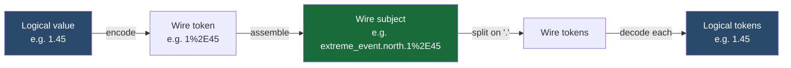

# Topic Encoding

Aviso uses a single backend-agnostic wire format for topics across all backends.

---

## Why This Exists

NATS subject tokenization uses `.` as the separator. Wildcards (`*`, `>`) also operate on
dot-delimited tokens. If topic field values contain any of these reserved characters,
they would silently break routing and filtering.

Example of the problem:

```
Logical value:  1.45
Naive subject:  mars.od.1.45      ← looks like 4 tokens, not 3
```

To prevent this, Aviso percent-encodes each token value before assembling the wire subject.

---

## Encoding Rules

Only four characters are reserved and must be encoded:

| Character | Encoded form | Reason |
|---|---|---|
| `.` | `%2E` | NATS token separator |
| `*` | `%2A` | NATS single-token wildcard |
| `>` | `%3E` | NATS multi-token wildcard |
| `%` | `%25` | Escape character itself (keeps decoding unambiguous) |

All other characters pass through unchanged.

---

## Encode → Wire → Decode Flow



The decoder is **strict**: malformed `%HH` sequences (e.g. `%GG`) are rejected, not passed through.

---

## Examples

### Encoding

| Logical value | Wire token |
|---|---|
| `1.45` | `1%2E45` |
| `1*34` | `1%2A34` |
| `1>0` | `1%3E0` |
| `1%25` | `1%2525` |

### Decoding (single pass)

| Wire token | Logical value |
|---|---|
| `1%2E45` | `1.45` |
| `1%2A34` | `1*34` |
| `1%2525` | `1%25` |
| `1%25` | `1%` |

---

## Impact on Wildcard Matching

Watch and replay requests use a two-step filter:

1. **Backend coarse filter** — operates on wire subjects (NATS wildcard matching)
2. **App-level wildcard match** — operates on **decoded** logical tokens

Both steps are safe with reserved characters because the app layer always decodes before matching.
Subscribers never need to think about encoding in their filter values — Aviso handles it transparently.

---

## Invariants

- Wire subject separator is always `.`
- One shared codec is used for all backends (JetStream and In-Memory)
- Encoding is applied per-token, not per-subject
- Decoding is a strict single-pass operation
